# Android 15 Window Insets (+ edge-to-edge)
Android 15 edge-to-edge 대응 codelab

## Codelab

|설명|화면|
|-|-|
|메인 화면|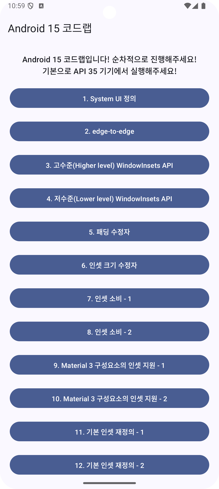|
|1. System UI 정의|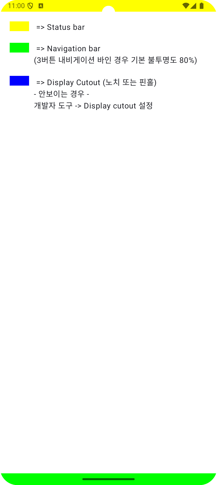|
|2. edge-to-edge|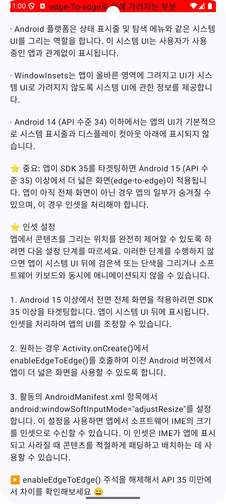|
|3. 고수준(Higher level) WindowInsets API|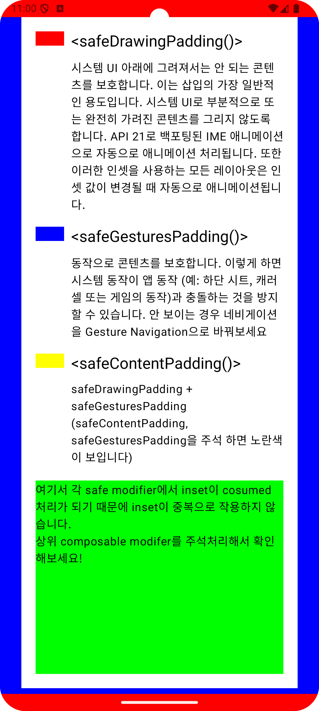|
|4. 저수준(Lower level) WindowInsets API|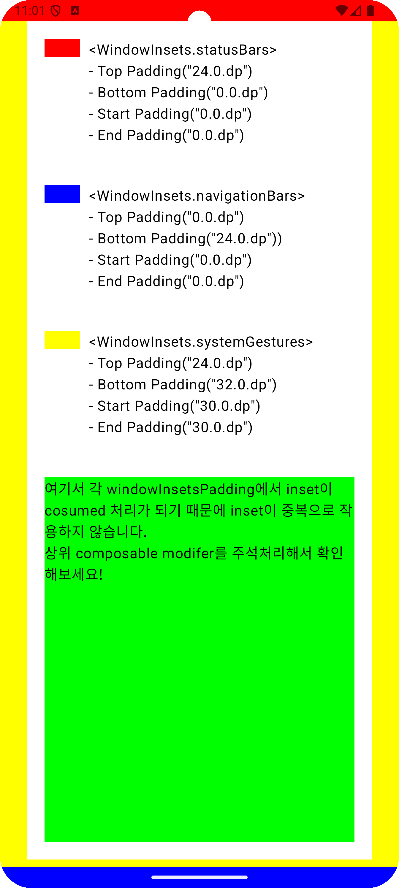|
|5. 패딩 수정자|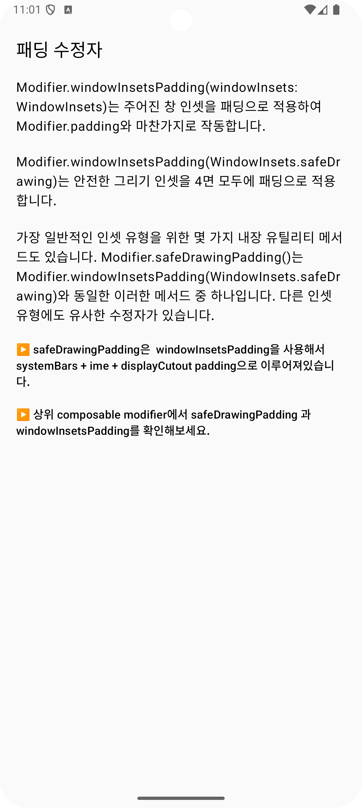|
|6. 인셋 크기 수정자"|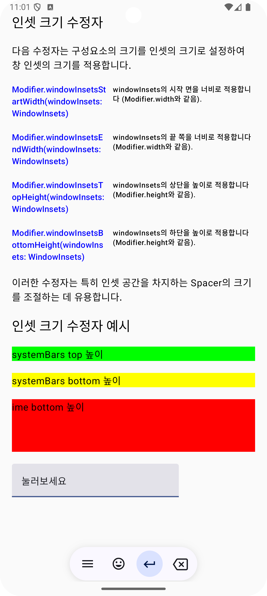|
|7. 인셋 소비 - 1|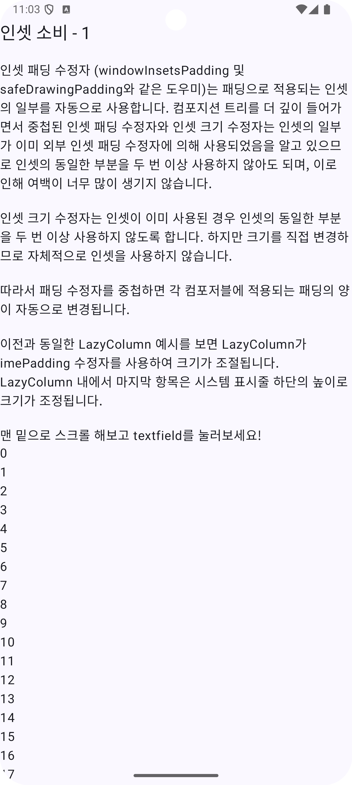|
|8. 인셋 소비 - 2|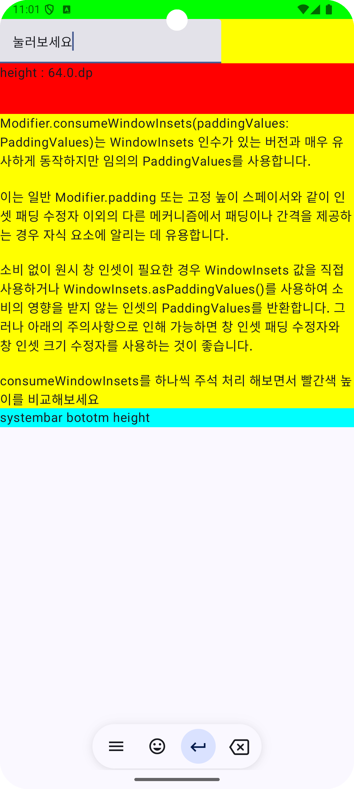|
|9. Material 3 구성요소의 인셋 지원 - 1|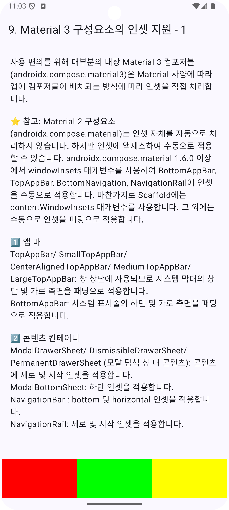|
|10. Material 3 구성요소의 인셋 지원 - 2|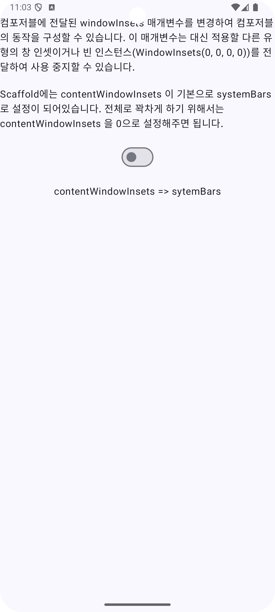|
|11. 기본 인셋 재정의 - 1|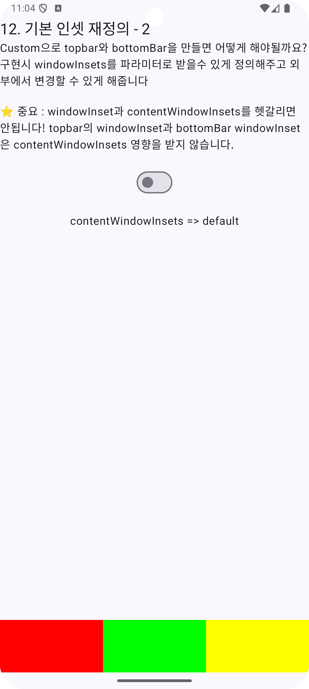|
|12. 기본 인셋 재정의 - 2|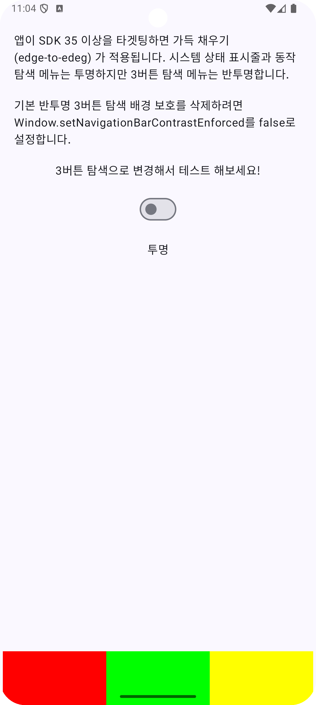|
|13. 시스템 표시줄 보호||
|14. xml(Android view) - 인셋을 사용하여 중복 처리|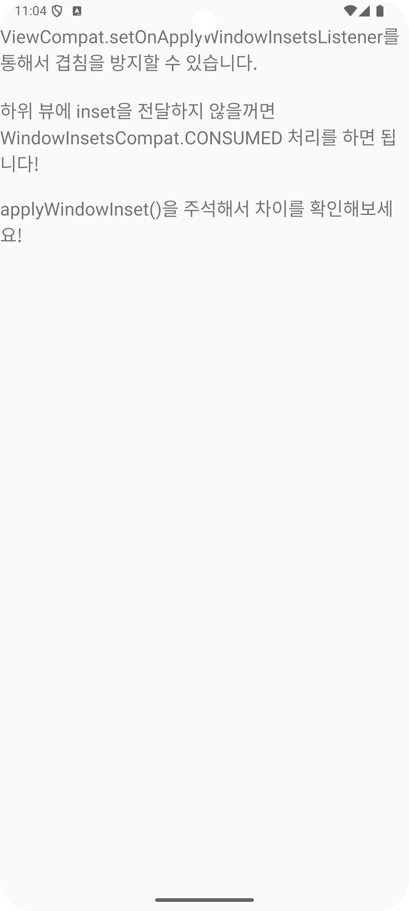|
|15. 부록 - 몰입형 모드|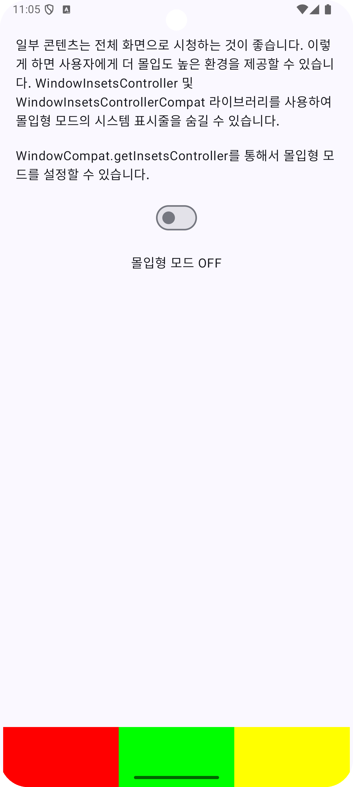|

